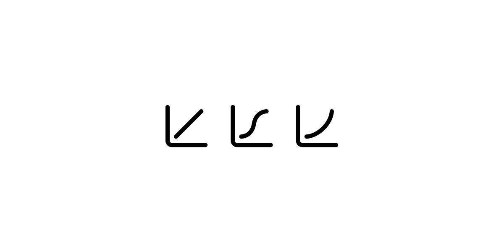

# Cubic Bezier Input

Easy to style and highly composable cubic bezier input.

## Installation

```
npm install cubic-bezier-input
```

## Anatomy

Import all parts and piece them together.

```jsx
<CubicBezier.Root>
  <CubicBezier.Grid />
  <CubicBezier.Controller index={1}>
    <CubicBezier.Line />
    <CubicBezier.Thumb />
  </CubicBezier.Controller>
  <CubicBezier.Controller index={2}>
    <CubicBezier.Line />
    <CubicBezier.Thumb />
  </CubicBezier.Controller>
  <CubicBezier.Curve>
    <CubicBezier.End />
  </CubicBezier.Curve>
</CubicBezier.Root>
```

## API Usage

### Root

| Prop             | Type                                             | Default                | Description                               |
| ---------------- | ------------------------------------------------ | ---------------------- | ----------------------------------------- |
| `value`          | `[number,number,number,number]`                  | -                      | The value of the cubic bezier.            |
| `defaultValue`   | `[number,number,number,number]`                  | `[0.25, 0.1, 0.25, 1]` | The default value of the cubic bezier.    |
| `onValueChange`  | `(value: [number,number,number,number]) => void` | -                      | The callback when the value changes.      |
| `onValueCommit`  | `(value: [number,number,number,number]) => void` | -                      | The callback when the value is committed. |
| `viewBoxPadding` | `number`                                         | `10`                   | The padding of the viewBox.               |

### Controller

| Prop    | Type     | Default | Description                   |
| ------- | -------- | ------- | ----------------------------- |
| `index` | `1 or 2` | -       | The index of the controllers. |

### Thumb

| Prop | Type     | Default | Description                       |
| ---- | -------- | ------- | --------------------------------- |
| `r`  | `number` | `5`     | The radius of the control thumbs. |

### End

| Prop | Type     | Default | Description                   |
| ---- | -------- | ------- | ----------------------------- |
| `r`  | `number` | `2`     | The radius of the end points. |

## Example Usage

- [Live Demo](cubic-bezier-input.vercel.app)
- [Example Usage](https://github.com/501A-gh/cubic-bezier-input/blob/main/www/app/Editor.tsx)
